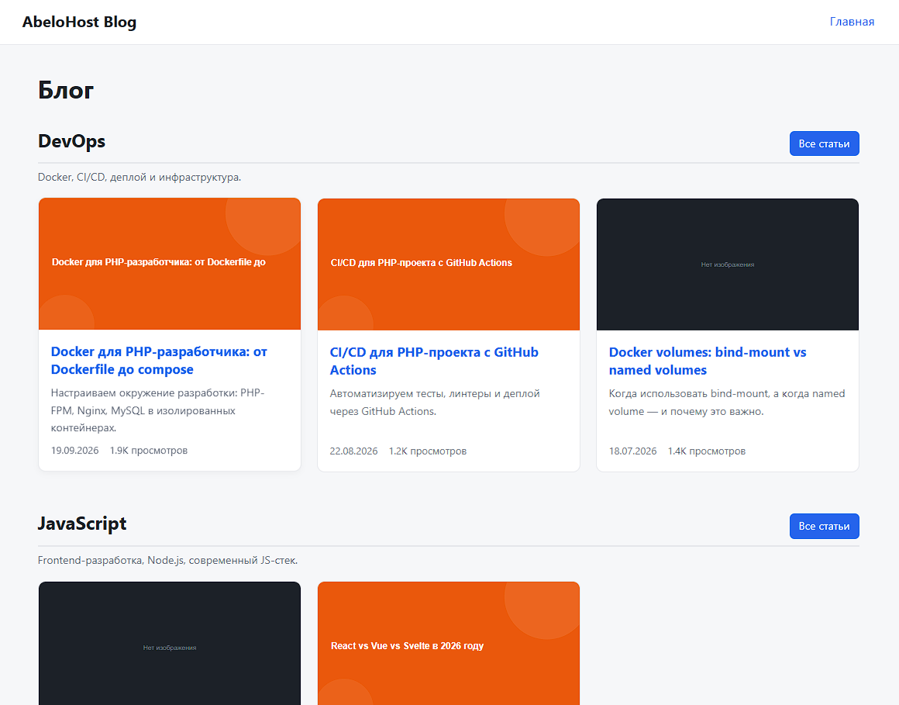
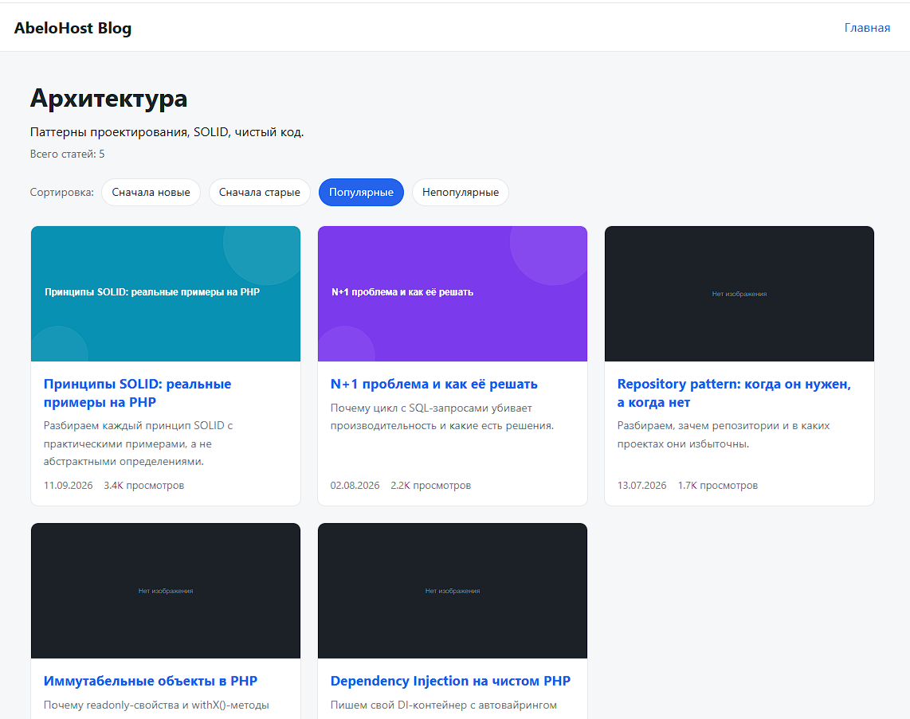
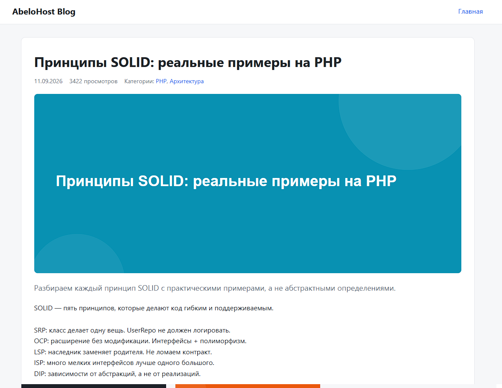

# AbeloHost Blog

Тестовое задание: блог на чистом PHP 8.1+ с категориями и статьями.
Без фреймворков. Smarty 5, MySQL 8.0, SCSS, Docker.

## Скриншоты

### Главная: категории с тремя последними статьями



### Страница категории: сортировка и пагинация



### Страница статьи: обложка, мета, похожие статьи



## Стек

- PHP 8.1+ (readonly, enum, match, first-class callable syntax)
- MySQL 8.0 (оконные функции, prepared statements, транзакции)
- Smarty 5 (автоэскейпинг через default_modifiers)
- SCSS (компиляция scssphp, ленивая по mtime)
- Docker (PHP-FPM + Nginx + MySQL 8.0), Makefile
- Composer только как менеджер зависимостей и автозагрузчик

## Быстрый старт

Требуется Docker 24+ и Docker Compose v2.

```bash
cp .env.example .env
make init
```

`make init` поднимает контейнеры, ставит зависимости, применяет миграции,
наполняет БД тестовыми данными и компилирует SCSS.

Открыть: http://localhost:8080

## Команды

```bash
make up         # поднять контейнеры
make down       # остановить
make restart    # перезапустить
make build      # пересобрать образ php без кэша
make logs       # логи в реальном времени
make shell      # зайти в php-контейнер
make composer   # composer install внутри контейнера
make migrate    # применить миграции
make rollback   # откатить последнюю миграцию
make seed       # наполнить БД тестовыми данными
make scss       # скомпилировать SCSS в CSS
make init       # первый запуск: всё сразу
make clean      # остановить и удалить volume с MySQL
```

## Структура проекта

```text
bin/            CLI-скрипты: migrate, seed, scss
config/         Конфиги приложения и БД (возвращают массивы)
database/       Миграции и сидеры (classmap-автозагрузка)
docker/         Dockerfile php-fpm и конфиг nginx
docs/           Скриншоты для README
public/         Document root: index.php, css, uploads
resources/      Smarty-шаблоны и SCSS-исходники
src/            Код приложения (PSR-4, namespace App\)
storage/        Логи и кэш Smarty
```

Слои внутри `src/`:

```text
Controller  принимает Request, вызывает Service, возвращает Response
Service     бизнес-логика: пагинация, сортировка, группировка
Repository  SQL-запросы, возвращает доменные модели
Model       иммутабельные DTO с хелперами представления
Support     DI-контейнер, обёртка Smarty, компилятор SCSS
```

## Схема БД

- `categories` - id, name, slug (unique), description, created_at
- `articles` - id, title, slug (unique), description, content (MEDIUMTEXT),
  image, views, published_at, created_at, updated_at
- `article_category` - составной PK (article_id, category_id), FK с ON DELETE CASCADE
- `migrations` - служебная таблица трекинга миграций

Индексы: `slug`, `published_at`, `views` - по ним строятся маршруты и сортировки.

## Принятые решения

### Главная страница без N+1

ТЗ требует "3 последних поста в каждой категории". Наивный подход - цикл
по категориям с запросом внутри (N+1). Здесь один запрос с оконной функцией:

```sql
SELECT * FROM (
    SELECT a.*, ac.category_id,
           ROW_NUMBER() OVER (
               PARTITION BY ac.category_id
               ORDER BY a.published_at DESC, a.id DESC
           ) AS rn
    FROM articles a
    INNER JOIN article_category ac ON ac.article_id = a.id
) AS ranked
WHERE rn <= 3
```

Группировка плоского результата по категориям выполняется в HomeService.

### Сортировка без риска инъекции

`ORDER BY` нельзя параметризовать через плейсхолдеры. Поэтому пользовательский
ввод маппится на enum `SortOrder` (whitelist), а SQL-выражение берётся из
`SortOrder::toSql()`. Попадание произвольной строки в запрос невозможно.

### Безопасность

- Prepared statements везде, `ATTR_EMULATE_PREPARES = false` - настоящие
  prepared statements на стороне MySQL.
- Автоэскейпинг Smarty: `default_modifiers = ['escape:"html"']` - XSS-защита
  по умолчанию; доверенный HTML выводится явно через `nofilter`.
- Атомарный инкремент просмотров одним UPDATE без SELECT - без race conditions.
- Класс `Csrf` с `hash_equals` готов к появлению форм (в текущем ТЗ форм нет).

### Похожие статьи

Агрегация по общим категориям: `COUNT(ac.category_id)` + `GROUP BY a.id`,
сортировка по числу совпадений и дате. Корректно под `ONLY_FULL_GROUP_BY`,
так как колонки функционально зависят от первичного ключа.

### Миграции

Собственный Migrator: таблица `migrations`, интерфейс `Migration` с up()/down(),
порядок по таймстамп-префиксу имени файла, поддержка `rollback N`.

## Автозагрузка: PSR-4 + classmap

Весь код приложения (`App\`) в `src/` подключён через **PSR-4** -
стандартный и предсказуемый способ: имя класса совпадает с путём файла.

Миграции (`Database\Migrations\`) и сидеры (`Database\Seeders\`)
подключены через **classmap**. Причина: PSR-4 требует точного совпадения
имени файла с именем класса (`CreateCategoriesTable.php`), а нам нужен
префикс-таймстамп для гарантии порядка применения:

```text
2026_09_30_000001_create_categories_table.php
2026_09_30_000002_create_articles_table.php
2026_09_30_000003_create_article_category_table.php
```

Classmap строит карту классов сканированием содержимого папки - имена
файлов для него не важны. Цена решения: после добавления новой миграции
или сидера нужно пересобрать карту:

```bash
docker compose exec --user root php composer dump-autoload -o
sudo chown -R $(id -u):$(id -g) vendor composer.lock
```

Альтернатива - писать имена файлов по PSR-4 без таймстампа и полагаться
на лексикографическую сортировку имён. Но тогда добавление миграции
"в середину" истории сломает порядок, а с таймстампом порядок фиксирован
навсегда. Это стандартный подход - так делают Laravel, Symfony, Phinx.

## Тестовые данные

`bin/seed.php` создаёт 6 категорий, 18 статей с русским контентом,
SVG-обложки в `public/uploads/` и связи many-to-many. Всё в одной
транзакции, повторный запуск идемпотентен (TRUNCATE + вставка).
Флаг `--clear` только очищает таблицы.

## Разработка

- Новая миграция: файл `database/migrations/2026_10_02_000004_name.php`,
  класс `Database\Migrations\Name`, затем `composer dump-autoload -o` и `make migrate`.
- Новый маршрут: регистрация в `public/index.php` вида
  `$router->get('/path', [Controller::class, 'method'])` - обработчики
  типобезопасные, опечатки ловит IDE.
- Стили: править `resources/scss/app.scss`, затем `make scss`.

### Если composer install таймаутит

В некоторых сетях DNS отдаёт только IPv6, и curl внутри контейнера виснет.
Рабочий обход - временное зеркало в `composer.json`:

```json
"repositories": [
    {"name": "packagist", "type": "composer", "url": "https://mirrors.aliyun.com/composer/"}
]
```

Блок используется только для локальной разработки и удаляется перед сдачей.

## Использование ИИ

При выполнении задания я использовал ИИ-ассистента как инструмент:

- генерация boilerplate (Dockerfile, nginx-конфиг, заготовки phpDoc, SCSS-база);
- проверка архитектурных решений и поиск ошибок (например, дублирующийся
  именованный параметр в prepared statement - MySQL с отключённой эмуляцией
  требует отдельный бинд на каждое вхождение);
- формулировки разделов документации.

Архитектура, схема БД, SQL-запросы (оконные функции, агрегации), бизнес-логика
и код слоёв Controller/Service/Repository написаны и осмыслены мной самостоятельно.
Все сгенерированные фрагменты вычитаны, исправлены и приведены к единому стилю.
ИИ не использовался как источник готового решения целиком.

## Требования

- Docker 24+
- Docker Compose v2
- Make

## Автор

Илья Васильев, тестовое задание для AbeloHost, 2026.
